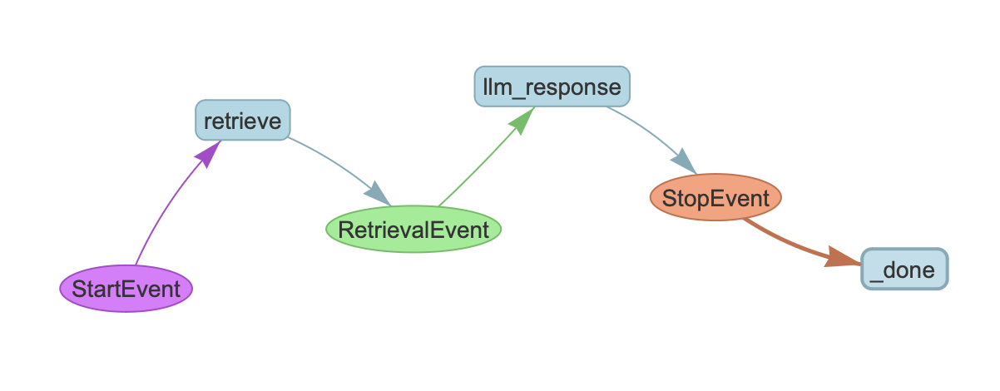
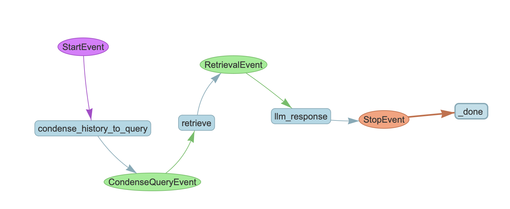

# LlamaIndex Workflow

## 1. Project Goal

This project “unboxes” the ready-made interface of LLamaIndex by breaking down main components of a Retrieval-Augmented Generation (RAG) pipeline. Understanding what is going on inside really helps in building our customized systems.

We start with out_of_the_box.py, a pre-built query engine from LlamaIndex Workflow. From there, we reconstruct a similar RAG pipeline orchestrated by Workflow, using core components such as indexing, retrieval, and response formation in basic_workflow.py. We then progress to more advanced scenarios, with features like conversational continuity and retrieved item re-ranking.


## 2. Set up
### Prerequisites
- Python 3.10
- Ollama: 
  - Donwload Ollama to your machine: https://ollama.com/download
  - Download Llama3.2:1b model: ```ollama pull llama3.2:1b```
  - Run llama3.2:1b: ```ollama run llama3.2:1b```

### Installation

1. Clone the repository:
    ```sh
    git clone https://github.com/gallegi/LlamaIndex-Workflow.git
    cd LlamaIndex-Workflow
    ```

2. Install the required dependencies:
    ```sh
    pip install -r requirements.txt
    ```

## 3. Show cases

### Out-of-the-box query engine
```sh
python out_of_the_box.py
```

### Basic RAG with Workflow

```sh
python basic_workflow.py
```
- Retrieves relevant nodes based on the user query.
- Generates responses from the language model using the retrieved context.
<p align="center">
    
    <br>
    <em>Figure 1: Basic Workflow Diagram</em>
</p>

### Advanced RAG Workflow

```sh
python advanced_workflow.py
```
- Condenses chat history and query into a single query string.
- Retrieves relevant nodes based on the condensed query.
- Use reranker model to rerank the retrieved nodes.
- Generates responses from the language model using the retrieved context.
- Remember the last context by managing chat history.

<p align="center">
    
    <br>
    <em>Figure 1: Advanced Workflow Diagram</em>
</p>


## Conclusion

This project gives you a closer look into a LlamaIndex RAG pipeline and highlights the capabilities of LlamaIndex Workflow in creating custom RAG systems. By following the provided examples, you can build your own workflows tailored to your specific needs.

For an offical Workflow tutorial, visit the [LlamaIndex documentation](https://docs.llamaindex.ai/en/stable/module_guides/workflow/).
